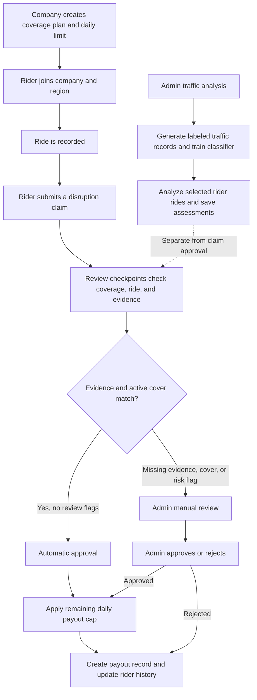

<div align="center">

# ❄️ GigShield

### Income protection for the people who keep cities moving.

A company-sponsored income-protection project for gig delivery riders. The delivery company owns the coverage plan and daily limit; riders can report weather or civic disruptions that interrupt a delivery.

<br />


<br />

**Company-funded cover · Explainable claim review · Rider and admin workspaces**

</div>

> [!IMPORTANT]
> GigShield is a project prototype, not an insurance provider or payment service. Ride histories and disruption events are generated for repeatable testing. Approved claims create payout records in the application; no money is transferred.

## ✨ At a glance

| For riders | For company administrators |
|:--|:--|
| Register under a company and service region | Manage companies, coverage plans, regions, and employees |
| Review delivery activity and protected income | Manage companies, coverage plans, regions, and riders |
| Raise a weather or civic disruption claim | Review claims with ride, weather, and disruption evidence |
| Follow claim-review checkpoints | Decide claims routed to manual review |
| View claim history and payout records | Run traffic analysis, analytics, and exposure scenarios |

GigShield follows a **company-purchases, rider-receives** coverage model. Riders do not buy policies themselves. A configured company coverage plan determines the potential payout for an eligible disruption.

## 🖥️ Screenshots

### Homepage


### Rider dashboard


### Admin dashboard


## 🧭 How GigShield works



The claim flow checks the reported disruption against the ride's zone, type, and time window, confirms that the sponsoring company has active cover, and applies the remaining daily limit. Weather claims may also include a current-weather check; that is not a historical weather lookup for the ride time. Repeated claims or an unusual ride-pattern signal can route an otherwise eligible claim to an administrator. These signals prompt review; they do not automatically reject a rider.

Claim review is shown as six saved checkpoints. Administrators can inspect claim evidence, ride details, route information, and the decision before resolving a manual review.

Starter delivery regions are **Chennai Central** (medium risk), **Mumbai** (high), **Tambaram** (low), and **Coimbatore** (medium). Administrators can manage service regions through the admin workspace.

### Separate admin traffic-analysis workflow

Administrators can generate labeled traffic records, train a **Random Forest** classifier, and analyze rides for a selected rider. The resulting assessments are stored for the admin view. This traffic-analysis workflow does **not** feed the claim approval decision. Its generated labels support model-training workflows; evaluation against those labels does not establish real-world traffic accuracy.

## 🧊 Tech stack

| Area | Technology |
|:--|:--|
| Web application | Next.js 14, React 18, Tailwind CSS |
| API | Python, FastAPI, Pydantic |
| Data | SQLAlchemy 2, SQLite by default; PostgreSQL supported |
| Authentication | JWT, bcrypt; separate rider and admin flows |
| Maps and charts | Leaflet / React Leaflet, custom SVG visualizations |
| Model workflows | scikit-learn Random Forest traffic classifier; Isolation Forest ride-pattern signal for claim review |
| Tests | Pytest |

## 🗂️ Repository map

```text
gigshield/
├── backend/
│   ├── app/
│   │   ├── api/          # Rider, ride, claim, payout, admin, and analytics endpoints
│   │   ├── core/         # Settings, database sessions, and authentication
│   │   ├── models/       # SQLAlchemy entities
│   │   ├── schemas/      # Pydantic API contracts
│   │   └── services/     # Claim rules, weather, traffic analysis, risk, payouts, scoring
│   ├── tests/            # Backend smoke tests
│   └── requirements.txt
├── frontend/
│   ├── app/              # Public, rider, and admin pages (Next.js App Router)
│   ├── components/       # Shared navigation, maps, and visual components
│   └── lib/              # API client and browser auth helpers
├── database/             # PostgreSQL schema for the compose setup
├── docs/                  # Project documentation
├── docker-compose.yml
└── README.md
```

## 🚀 Run locally

### Requirements

- Python 3.11 or newer
- Node.js 18 or newer and npm
- PostgreSQL is optional for local development; SQLite is the default

### 1. Start the API

```powershell
cd backend
python -m venv .venv
.venv\Scripts\Activate.ps1
pip install -r requirements.txt
uvicorn app.main:app --reload --reload-dir app
```

For macOS or Linux, activate the virtual environment with `source .venv/bin/activate`.

The API starts at <http://localhost:8000>. Interactive API documentation is at <http://localhost:8000/docs>. On startup, the API creates missing tables and seeds the default service regions. SQLite writes to `backend/gigshield.db` unless `DATABASE_URL` is set.

### 2. Configure and start the web app

In a second terminal:

```powershell
cd frontend
npm install
Copy-Item .env.local.example .env.local
npm run dev
```

Open <http://localhost:3000>. The frontend API URL is configured by `NEXT_PUBLIC_API_BASE_URL` in `frontend/.env.local` and defaults to `http://localhost:8000`.

### 3. Create a company and coverage plan

Regions are seeded by the backend. Before registering a rider, create at least one company and one coverage plan. You can use the admin pages or the Swagger API at <http://localhost:8000/docs>.

For a quick local prototype, create a company and plan with the API:

```powershell
$company = Invoke-RestMethod -Method Post `
  -Uri http://localhost:8000/companies/ `
  -ContentType 'application/json' `
  -Body '{"name":"Demo Delivery Co"}'

Invoke-RestMethod -Method Post `
  -Uri http://localhost:8000/coverage-plans/ `
  -ContentType 'application/json' `
  -Body (ConvertTo-Json @{ company_id = $company.company_id; tier_name = 'Standard'; payout_per_day = 300 })
```

### 4. Explore the rider flow

1. Create a company and its coverage plan from an administrator account.
2. Register a rider under that company and a service region.
3. Open **Rides**, select a delivery, and report a weather or civic disruption.
4. Follow the six review checkpoints. Matching evidence and active coverage can lead to automatic approval; missing coverage/evidence or review flags send the claim to the admin queue.
5. Check the capped payout record and claim history in the rider workspace, or inspect the evidence and decision from the admin workspace.

For the administrator flow, sign in through the admin login and use the sidebar to manage coverage, inspect claims, view payouts and analytics, or open **Traffic analysis**. Traffic analysis has separate actions to generate records, train the classifier, and analyze one employee's rides. The stress-test view estimates exposure at several disruption rates; it is read-only and does not create claims or payouts. Local admin credentials are configurable with `ADMIN_USERNAME` and `ADMIN_PASSWORD` in `backend/.env`; defaults are `admin` / `changeme123`.

> [!WARNING]
> The default admin credentials and JWT secret are for local demonstration only. Change them before exposing the app to any network. Never commit real secrets.

## 🔌 API overview

The complete, live schema is available at `/docs` while the backend is running.

| Method | Path | Purpose |
|:--|:--|:--|
| `GET` | `/health` | API health check |
| `POST` | `/admin/login` | Start an admin session |
| `POST` / `GET` | `/riders/register`, `/riders/login` | Register or authenticate a rider |
| `GET` | `/riders/me` | Current rider profile |
| `GET` / `POST` | `/companies/`, `/zones/`, `/coverage-plans/` | List or manage coverage setup |
| `POST` | `/rides/simulate` | Generate demo deliveries for the authenticated rider |
| `GET` | `/rides/me` | Rider's delivery history |
| `POST` | `/claims/` | Submit and assess a rider claim |
| `GET` | `/claims/{token_id}/progress` | Read the six review checkpoints |
| `GET` | `/claims/me` | Rider's claim history |
| `GET` | `/claims/manual-review` | Admin manual-review queue |
| `GET` | `/claims/admin` | Admin claim history with outcome summaries |
| `GET` | `/claims/{token_id}/detail` | Admin claim evidence and delivery details |
| `PATCH` | `/claims/{token_id}/decision` | Approve or reject a claim in manual review |
| `GET` | `/payouts/me` | Rider payout records |
| `GET` | `/analytics/summary` | Admin analytics |
| `GET` | `/analytics/stress-test` | Read-only disruption exposure scenarios |
| `POST` | `/admin/traffic-analysis/employees/{rider_id}/generate-dataset` | Generate labeled traffic records for a rider's zone |
| `POST` | `/admin/traffic-analysis/model/train` | Train the traffic classifier |
| `POST` | `/admin/traffic-analysis/employees/{rider_id}/run` | Analyze and save assessments for an employee's rides |

## 🧪 Tests

```powershell
cd backend
pytest tests/test_smoke.py -v
```

## 🛠️ Configuration

Copy `backend/.env.example` to `backend/.env` when you need to override defaults. Common settings:

| Variable | Use |
|:--|:--|
| `DATABASE_URL` | Database connection; default is local SQLite |
| `JWT_SECRET` | Secret used to sign access tokens |
| `ADMIN_USERNAME`, `ADMIN_PASSWORD` | Local administrator login |
| `OPENWEATHERMAP_API_KEY` | Optional weather provider configuration |
| `RAZORPAY_KEY_ID`, `RAZORPAY_KEY_SECRET` | Reserved test payment configuration; prototype payouts do not transfer funds |

## 📌 Scope and limitations

- Ride histories, disruption fixtures, and generated traffic labels support repeatable project testing; they are not a live gig-platform, traffic, or curfew feed.
- Weather checks may use the configured provider for current conditions; they do not retrieve past weather for a ride's historical timestamp.
- Traffic-model scores describe predictions within the generated labeled records. They are not validated real-world traffic predictions and do not decide claims.
- Approved claims calculate and record a payout; no real payment is executed.
- The admin login is environment-configured and intended for local project use, not production identity management.
- Do not use this project to make real insurance, employment, or fraud decisions.

## 📄 License

No license has been specified for this class project.
