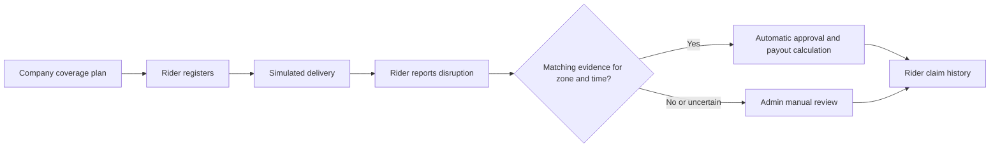

<div align="center">

# ❄️ GigShield

### Income protection for the people who keep cities moving.

An exploratory parametric-insurance prototype for gig delivery riders. Delivery companies sponsor coverage; riders can report weather or civic disruptions that interrupt a delivery.

<br />


<br />

**Company-sponsored cover · Evidence-based claim decisions · Simulated data**

</div>

> [!IMPORTANT]
> GigShield is a demonstration prototype. It uses fabricated rides and demo disruption fixtures; it does not transfer money or provide real insurance coverage.

## ✨ At a glance

| For riders | For company administrators |
|:--|:--|
| Register under a company and service region | Manage companies, coverage plans, regions, and employees |
| Explore simulated delivery history | Review claims alongside disruption evidence and route details |
| Raise a claim against a completed delivery | Inspect platform analytics and claim outcomes |
| See approved protection and claim history | Decide claims that require manual review |

GigShield follows a **company-purchases, rider-receives** coverage model. Riders do not buy policies themselves. A configured company coverage plan determines the potential payout for an eligible disruption.

## 🖥️ Screenshots

### Homepage


### Rider dashboard


### Admin dashboard


## 🧭 How a claim moves through the prototype



The decision engine checks whether recorded disruption evidence overlaps the delivery's zone, type, and time window. Some prototype claims use repeatable demo fixtures so the automatic approval and evidence-review paths can be demonstrated without depending on live conditions. Unmatched claims are routed to review rather than automatically rejected.

## 🧊 Tech stack

| Area | Technology |
|:--|:--|
| Web application | Next.js 14, React 18, Tailwind CSS |
| API | Python, FastAPI, Pydantic |
| Data | SQLAlchemy 2, SQLite by default; PostgreSQL supported |
| Authentication | JWT, bcrypt; separate rider and admin flows |
| Maps and charts | Leaflet / React Leaflet, custom SVG visualizations |
| Tests | Pytest |

## 🗂️ Repository map

```text
gigshield/
├── backend/
│   ├── app/
│   │   ├── api/          # Rider, ride, claim, admin, and analytics endpoints
│   │   ├── core/         # Settings, database sessions, and authentication
│   │   ├── models/       # SQLAlchemy entities
│   │   ├── schemas/      # Pydantic API contracts
│   │   └── services/     # Claim assessment, demo data, weather, payouts, scoring
│   ├── tests/            # Backend smoke tests
│   └── requirements.txt
├── frontend/
│   ├── app/              # Public, rider, and admin pages (Next.js App Router)
│   ├── components/       # Shared navigation, maps, and visual components
│   └── lib/              # API client and browser auth helpers
├── database/             # PostgreSQL schema for the compose setup
├── docs/                  # Project documentation
├── docker-compose.yml
└── README.md
```

## 🚀 Run locally

### Requirements

- Python 3.11 or newer
- Node.js 18 or newer and npm
- PostgreSQL is optional for local development; SQLite is the default

### 1. Start the API

```powershell
cd backend
python -m venv .venv
.venv\Scripts\Activate.ps1
pip install -r requirements.txt
uvicorn app.main:app --reload --reload-dir app
```

For macOS or Linux, activate the virtual environment with `source .venv/bin/activate`.

The API starts at <http://localhost:8000>. Interactive API documentation is at <http://localhost:8000/docs>. On startup, the API creates missing tables and seeds the default service regions. SQLite writes to `backend/gigshield.db` unless `DATABASE_URL` is set.

### 2. Configure and start the web app

In a second terminal:

```powershell
cd frontend
npm install
Copy-Item .env.local.example .env.local
npm run dev
```

Open <http://localhost:3000>. The frontend API URL is configured by `NEXT_PUBLIC_API_BASE_URL` in `frontend/.env.local` and defaults to `http://localhost:8000`.

### 3. Create a company and coverage plan

Regions are seeded by the backend. Before registering a rider, create at least one company and one coverage plan. You can use the admin pages or the Swagger API at <http://localhost:8000/docs>.

For a quick local prototype, create a company and plan with the API:

```powershell
$company = Invoke-RestMethod -Method Post `
  -Uri http://localhost:8000/companies/ `
  -ContentType 'application/json' `
  -Body '{"name":"Demo Delivery Co"}'

Invoke-RestMethod -Method Post `
  -Uri http://localhost:8000/coverage-plans/ `
  -ContentType 'application/json' `
  -Body (ConvertTo-Json @{ company_id = $company.company_id; tier_name = 'Standard'; payout_per_day = 300 })
```

### 4. Explore the rider flow

1. Register a rider using the new company and a seeded region.
2. Sign in and open **Rides** to generate sample deliveries.
3. Open a delivery and submit a weather or civic disruption claim.
4. Review the decision and payout details from the rider dashboard and claims page.

For the administrator flow, sign in through the admin login and use the sidebar to review claim evidence, manage setup data, and view analytics. Local demo credentials are configurable with `ADMIN_USERNAME` and `ADMIN_PASSWORD` in `backend/.env`; defaults are `admin` / `changeme123`.

> [!WARNING]
> The default admin credentials and JWT secret are for local demonstration only. Change them before exposing the app to any network. Never commit real secrets.

## 🔌 API overview

The complete, live schema is available at `/docs` while the backend is running.

| Method | Path | Purpose |
|:--|:--|:--|
| `GET` | `/health` | API health check |
| `POST` | `/admin/login` | Start an admin session |
| `POST` / `GET` | `/riders/register`, `/riders/login` | Register or authenticate a rider |
| `GET` | `/riders/me` | Current rider profile |
| `GET` / `POST` | `/companies/`, `/zones/`, `/coverage-plans/` | List or manage coverage setup |
| `POST` | `/rides/simulate` | Generate demo deliveries for the authenticated rider |
| `GET` | `/rides/me` | Rider's delivery history |
| `POST` | `/claims/` | Submit and assess a rider claim |
| `GET` | `/claims/me` | Rider's claim history |
| `GET` | `/claims/admin` | Admin claim history with outcome summaries |
| `GET` | `/claims/{token_id}/detail` | Admin claim evidence and delivery details |
| `GET` | `/analytics/summary` | Admin analytics |

## 🧪 Tests

```powershell
cd backend
pytest tests/test_smoke.py -v
```

## 🛠️ Configuration

Copy `backend/.env.example` to `backend/.env` when you need to override defaults. Common settings:

| Variable | Use |
|:--|:--|
| `DATABASE_URL` | Database connection; default is local SQLite |
| `JWT_SECRET` | Secret used to sign access tokens |
| `ADMIN_USERNAME`, `ADMIN_PASSWORD` | Local administrator login |
| `OPENWEATHERMAP_API_KEY` | Optional weather provider configuration |
| `RAZORPAY_KEY_ID`, `RAZORPAY_KEY_SECRET` | Reserved test payment configuration; prototype payouts do not transfer funds |

## 📌 Prototype boundaries

- Rides and disruption fixtures are simulated; they are not connected to gig-platform accounts or live traffic/curfew feeds.
- Weather checks may use configured provider data, but demo fixtures are used to make prototype scenarios repeatable.
- Approved claims calculate and record a prototype payout; no real payment is executed.
- The admin account is a single environment-configured prototype credential, not a production identity-management system.
- Do not use this project to make real insurance or employment decisions.

## 📄 License

No license has been specified for this class project.
